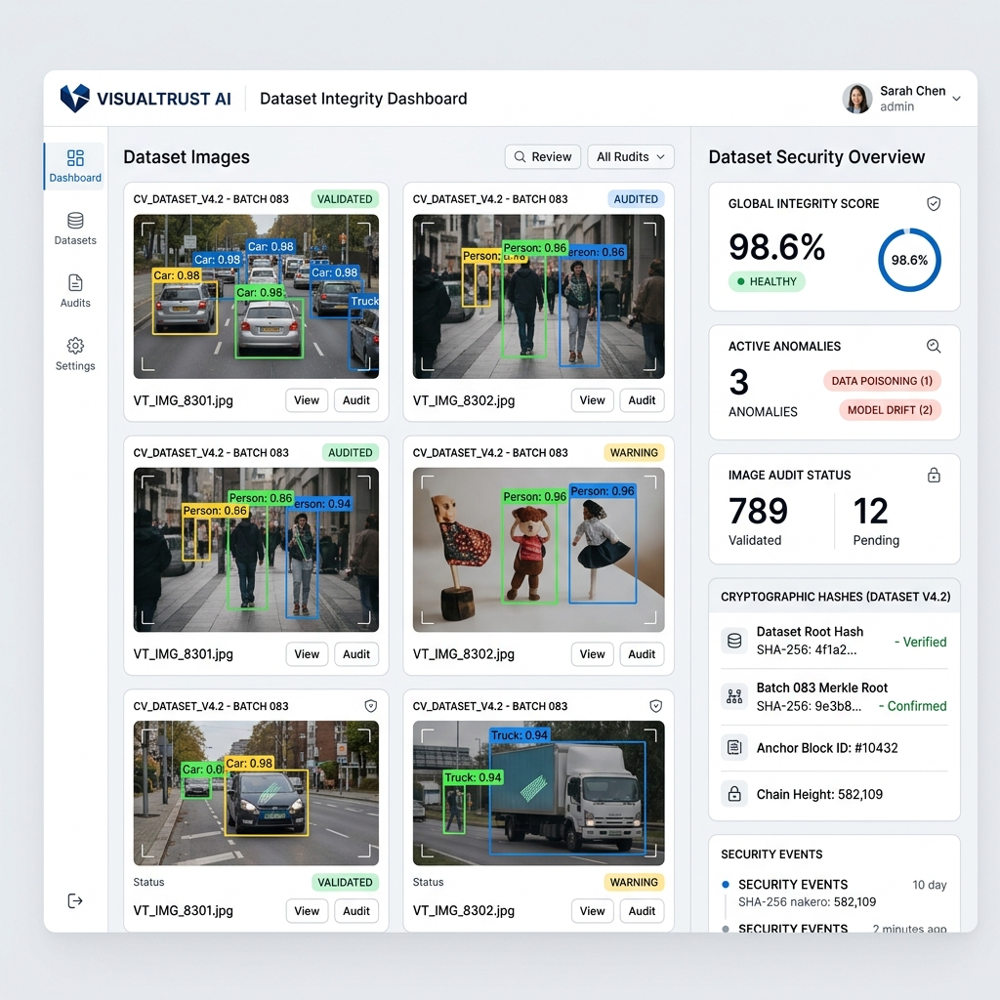

<div align="center">
  
  
  <h1>🛡️ TRUSTTRACE CV</h1>
  <p><strong>Offline-First Integrity Assurance for Computer Vision Assets</strong></p>

  [](https://www.python.org/)
  [](https://fastapi.tiangolo.com/)
  [](#)
  [](#)
</div>

---

**TRUSTTRACE CV** is a premium, enterprise-grade, model-agnostic assurance pipeline designed specifically to secure the computer vision machine learning lifecycle. It delivers deterministic cryptographic verification and advanced statistical heuristics to protect training data, model artifacts, and inference records from tampering, poisoning, and supply-chain attacks.

## ✨ Key Capabilities

| Domain | Feature | Description |
| :--- | :--- | :--- |
| 📊 **Dataset** | **Duplicate Flooding** | Uses SHA-256 digests to instantly detect and flag duplicated assets. |
| 📊 **Dataset** | **Format Validation** | Strict structural validation of YOLO and COCO schema annotations. |
| 🛡️ **Security** | **Label Flipping** | Detects statistical variance in class IDs to flag targeted poisoning. |
| 🛡️ **Security** | **Trigger Patterns** | Advanced patch-level Shannon entropy scans to uncover solid/zero-entropy backdoor triggers. |
| 📈 **Statistics** | **OOD Detection** | Flags statistical outliers using Mahalanobis distance across pixel distributions. |
| 🧩 **Models** | **Identity Verification** | Validates PyTorch, TorchScript, and ONNX models against strict cryptographic reference manifests. |
| 🔐 **Inference** | **Tamper Detection** | Cryptographically signs inference logs (HMAC-SHA256) to completely eliminate replay attacks and tampering. |

## 📐 Architecture & Integration

TRUSTTRACE CV operates completely offline, ensuring maximum data privacy and security. 

- **Modular Backend (`src/`)**: Built on FastAPI, the backend handles dataset parsing, bounding box normalization, integrity calculations, and logging to an append-only `audit_events.sqlite`.
- **Dynamic Frontend (`src/ui/`)**: A sleek, real-time analytics dashboard built with modern aesthetics.
- **Reporting (`src/reporting/`)**: Automatically compiles self-contained HTML forensic reports embedding original base64 imagery and bounding box coordinates for strict, portable evidence gathering.

### 🔌 Extensibility (`src/integrations/`)

We developed TRUSTTRACE CV with an **Adapter Pattern** (`src/integrations/`) to easily interface with leading industry open-source security tools (such as *CleanVision*, *Cleanlab*, *ART*, *BackdoorBench*, *TrojAI*, *in-toto*, and *Cosign*). These adapters ensure that when the environment supports it, we can delegate heavy computations to established frameworks seamlessly via their Python APIs, while falling back gracefully in completely offline or isolated environments without bloating the core repository.

## 🚀 Quickstart Guide

### Prerequisites
- Operating System: Windows, Linux, or macOS
- Python: 3.9 or higher

### Installation

1. **Clone the repository:**
   ```bash
   git clone https://github.com/x2ankit/trusttracecv.git
   cd trusttracecv
   ```

2. **Setup your environment:**
   ```bash
   conda create -n trusttrace python=3.10
   conda activate trusttrace
   pip install -r requirements.txt
   ```

3. **Configure Environment:**
   ```bash
   cp .env.example .env
   ```

4. **Run the Application:**
   ```bash
   python run_server.py
   ```
   Navigate to `http://localhost:8000` to access the premium web dashboard.

## 🧪 Testing

TRUSTTRACE CV is backed by a rigorous automated test suite relying on fully reproducible synthetic datasets.
```bash
pytest tests/ -v
```
*(All 90 automated tests are fully passing).*

## 📚 Documentation 

For deep dives into our methodologies, constraints, and architecture:
- 🏗️ [**ARCHITECTURE**](docs/ARCHITECTURE.md)
- 🔒 [**SECURITY & THREAT MODEL**](docs/SECURITY_AND_THREAT_MODEL.md)
- 🧪 [**DATASET TESTING**](docs/DATASET_TESTING.md)
- 🔌 [**API REFERENCE**](docs/API_REFERENCE.md)
- 🛠️ [**DEVELOPMENT GUIDE**](docs/DEVELOPMENT.md)

---
<div align="center">
  <i>Built for resilience. Designed for security.</i>
</div>
