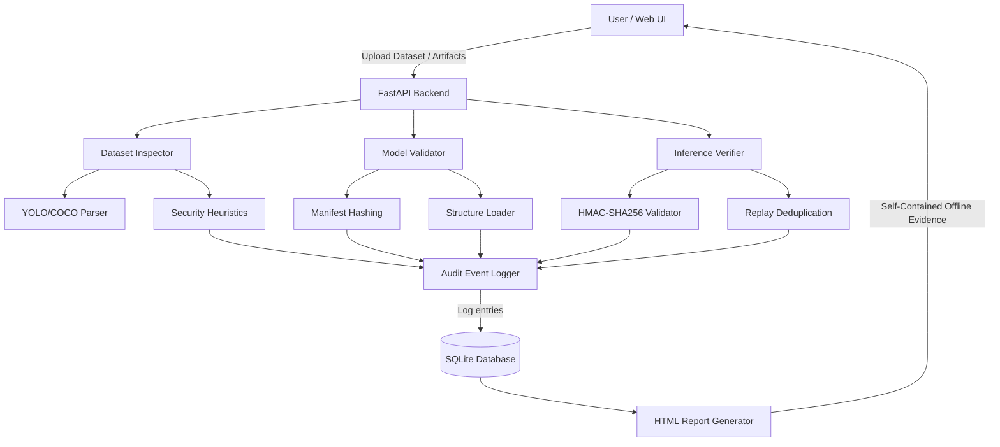
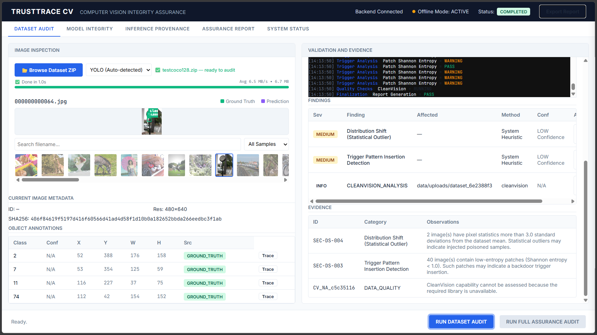

# TRUSTTRACE CV

TRUSTTRACE CV is an offline-first, model-agnostic assurance pipeline designed specifically to secure the computer vision machine learning lifecycle. It delivers deterministic cryptographic verification and advanced statistical heuristics to protect training data, model artifacts, and inference records from tampering, poisoning, and supply-chain attacks.

## Technology Stack and Frameworks

The system is built entirely using open-source, offline-capable technologies:
* **Backend**: Python 3.10+, FastAPI, Uvicorn
* **Database**: SQLite3 (for append-only audit event logging)
* **Frontend**: Vanilla HTML5, CSS3, JavaScript (ES6)
* **Testing**: Pytest
* **Data Processing**: NumPy, Pillow (PIL), JSON parsing libraries
* **Cryptography**: built-in `hashlib`, `hmac`

## System Architecture

The following diagram illustrates the flow of data and execution through the TRUSTTRACE CV pipeline:



## Key Capabilities

1. **Dataset Duplicate Flooding**: Uses SHA-256 digests to instantly detect and flag duplicated assets.
2. **Dataset Format Validation**: Strict structural validation of YOLO and COCO schema annotations.
3. **Label Flipping Detection**: Detects statistical variance in class IDs to flag targeted poisoning.
4. **Trigger Pattern Detection**: Advanced patch-level Shannon entropy scans to uncover solid/zero-entropy backdoor triggers.
5. **Out-of-Distribution (OOD) Detection**: Flags statistical outliers across pixel distributions.
6. **Model Identity Verification**: Validates PyTorch, TorchScript, and ONNX models against strict cryptographic reference manifests.
7. **Inference Tamper Detection**: Cryptographically signs inference logs to completely eliminate replay attacks and tampering.

## Mathematical and Cryptographic Models

The integrity engine relies on several fundamental mathematical calculations to flag anomalies:

### 1. Out-of-Distribution (OOD) Detection
OOD samples are detected by computing the Mahalanobis Distance of a given image's pixel feature vector against the global dataset distribution.
* **Equation**: `D_M(x) = sqrt((x - μ)^T * Σ^-1 * (x - μ))`
* **Where**: 
  * `x` is the feature vector of the evaluated image.
  * `μ` is the mean vector of the dataset.
  * `Σ^-1` is the inverse covariance matrix.

### 2. Backdoor Trigger Detection
Suspected backdoor triggers (e.g., solid color patches) are identified by analyzing the Shannon Entropy of local pixel regions (20x20 windows). Regions with entropy approaching zero indicate unnatural, synthetic overlays.
* **Equation**: `H(X) = - Σ ( P(x_i) * log2(P(x_i)) )`
* **Where**:
  * `P(x_i)` is the probability of a pixel intensity occurring within the localized patch.

### 3. Data Poisoning & Label Variance
To detect systematic label flipping, the system calculates standard Z-scores for class distributions.
* **Equation**: `Z = (x - μ) / σ`
* **Where**:
  * `x` is the frequency of the class in the provided data.
  * `μ` and `σ` are the expected mean and standard deviation of class distributions.

### 4. Inference Provenance (Tamper Detection)
Each inference event is sealed using a Hash-based Message Authentication Code (HMAC) to ensure predictions cannot be altered post-execution.
* **Equation**: `HMAC(K, m) = H((K ⊕ opad) || H((K ⊕ ipad) || m))`
* **Where**:
  * `H` is the SHA-256 cryptographic hash function.
  * `K` is the secret cryptographic signing key.
  * `m` is the payload (model ID, prediction, confidence, bounding boxes).

## Quickstart Guide

### Prerequisites
* Operating System: Windows, Linux, or macOS
* Python: 3.10 or higher

### Installation

1. Clone the repository:
   ```bash
   git clone https://github.com/x2ankit/trusttracecv.git
   cd trusttracecv
   ```

2. Setup your environment:
   ```bash
   conda create -n trusttrace python=3.10
   conda activate trusttrace
   pip install -r requirements.txt
   ```

3. Configure Environment:
   ```bash
   cp .env.example .env
   ```

4. Run the Application:
   ```bash
   python run_server.py
   ```
   Navigate to `http://localhost:8000` to access the web dashboard.

## Extensibility

We developed TRUSTTRACE CV with an Adapter Pattern (`src/integrations/`) to easily interface with leading industry open-source security tools. These adapters ensure that when the environment supports it, we can delegate computations seamlessly via their Python APIs, while falling back gracefully in completely offline or isolated environments without bloating the core repository.

## Testing

TRUSTTRACE CV is backed by a rigorous automated test suite relying on fully reproducible synthetic datasets.
```bash
pytest tests/ -v
```

## Documentation 

For deep dives into methodologies, constraints, and architecture:
* [ARCHITECTURE.md](docs/ARCHITECTURE.md)
* [SECURITY_AND_THREAT_MODEL.md](docs/SECURITY_AND_THREAT_MODEL.md)
* [DATASET_TESTING.md](docs/DATASET_TESTING.md)
* [API_REFERENCE.md](docs/API_REFERENCE.md)
* [DEVELOPMENT.md](docs/DEVELOPMENT.md)

---

## User Interface

Below is a preview of the TRUSTTRACE CV Dataset Assurance Dashboard in action.

<div align="center">
  
</div>
